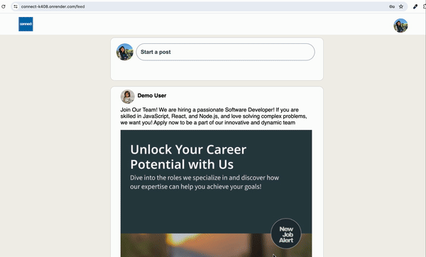
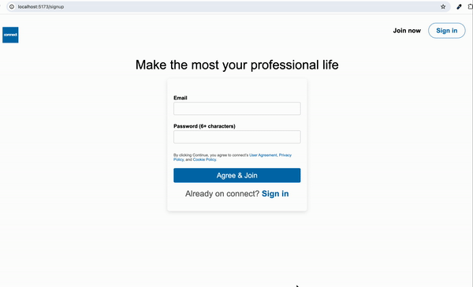

# CONNECT

Check out the <a href="https://connect-k408.onrender.com/" target="_blank">LIVE SITE</a>


## Introduction

Connect is a full-stack web application designed to emulate the LinkedIn experience. Users can post and share professional content. The application features a responsive React/Redux frontend, Ruby on Rails backend for efficient data handling, and a PostgreSQL database.

## Technologies used

### Languages
- **Javascript:** 
- **Ruby:** 
- **HTML:** 
- **SCSS:** 

### Backend
- **Ruby on Rails:** 

### Database
- **PostgreSQL:**

### Frontend
- **React.js:** 
- **Redux:**
- **NPM:** 

### Storage
- **AWS S3:** 

### Hosting
- **Render:**

## Key Features

### User Authentication

#### 1. Secure Account Management:
- Users can sign up for personalized accounts, complete with secure login and logout functionalities.
- Backend security is bolstered with CSRF tokens for request validation.

#### 2.  Error Handling:
- If login credentials don't match records, users are promptly informed.
- If email is not in a valid format or password below 6 characters, error is displayed
- If emails already exists when the user tries to sign-up, user is informed that the email is already taken.

#### 3. Demo User Access:
- Users can swiftly explore the platform using a demo login, bypassing the need for personal credentials.


### POSTS
- On the feed page, logged in users can create a post.
- User can update/delete their own POSTS.
- User can view other's posts but cannot make changes to their POSTS.


## Code Snippets

1. #### Display Edit/Delete Options for the Post only if the post belongs to the user who is logged-in:



```js
<>
    {!isEditMode && (
        <div className="post-box"> 
            <div className="post-name-and-menu">
                <div className="photo-and-name">
                {author?.photoUrl ? (
                
                    ) : (<span className="profile-icon"><FaUserCircle /></span>
                    )}
                <span className="author-name">{author.firstName} {author.lastName}</span>
                </div>
                <div className="post-body">{post.body}</div>
                {post?.imageUrl ? (
                    
                ) : null }   
            </div>
            <div>
                {author.id === sessionUser && (
                        <>
                        {!showMenu && (
                            <button onClick={toggleMenu} className="horizontal-menu"><FiMoreHorizontal /></button>
                        )}
                        {showMenu && (
                            <ul className="post-dropdown" ref={dropdownRef}>
                                <li>
                                    <button onClick={editPost}>Edit</button>
                                </li>
                                <li>
                                    <button onClick={deletePost}>Delete</button>
                                </li>
                            </ul>
                        )}
                        </>
                    )}
            </div>
        </div>
    )}
    {isEditMode && (
        <div className="modal-overlay">
                <div className="modal">
                    <div className="modal-header">
                        <span className="modal-header-name-photo">
                            {author?.photoUrl ? (
                            
                            ) : (<span className="start-post-profile-icon"><FaUserCircle /></span>
                            )}
                            <span className="modal-name">{author.firstName} {author.lastName.charAt(0)}</span>
                        </span>
                        <button className="close-button" onClick={closeModal}>X</button>
                    </div>
                    <textarea value={body} onChange={(e) => setBody(e.target.value)}></textarea>
                    <div className="bottom-border"></div>
                    <div className="modal-post-button">
                    <button onClick={updatePost} className="post-submit-button">Save</button>
                    </div>  
                </div>
        </div>
    )}
</>
```

2. #### Display Firstname and Lastname fields on the signup screen only after entering the Email and Password:



```js
<p className="main-title">Make the most your professional life</p>
      <div className="container">
      <div className="signup-box">
          <ul className="errors">
            {errors.map(error => <li key={error}>{error}</li>)}
          </ul>
         {!nameScreen && ( 
          <>
          <form onSubmit={agreeButton}>
          <label>Email</label>
          <input type="text" className="input-field" value={email} onChange={(e) => setEmail(e.target.value)} required/>
          <label>Password (6+ characters) </label>
          <input type="password" className="input-field" value={password} onChange={(e) => setPassword(e.target.value)} required/>
          <p className="terms">
                  By clicking Continue, you agree to connect’s <a href="#">User Agreement</a>, <a href="#">Privacy Policy</a>, and <a href="#">Cookie Policy</a>.
          </p>
          <button type="submit" className="sign-up-button">Agree & Join</button>
        </form>
        <p className="sign-in">Already on connect? <Link to={"/login"}>Sign in</Link></p>
        </>
         )} 
          {nameScreen && ( 
          <form onSubmit={handleSubmit}>
          <label>First name</label>
          <input type="text" className="input-field" value={first_name} onChange={(e) => setFirstname(e.target.value)} required/>
          <label>Last name</label>
          <input type="text" className="input-field" value={last_name} onChange={(e) => setLastname(e.target.value)} required/>
          <button type="submit" className="sign-up-button">Continue</button>
        </form>
         )} 
      </div>
    </div> 
```
